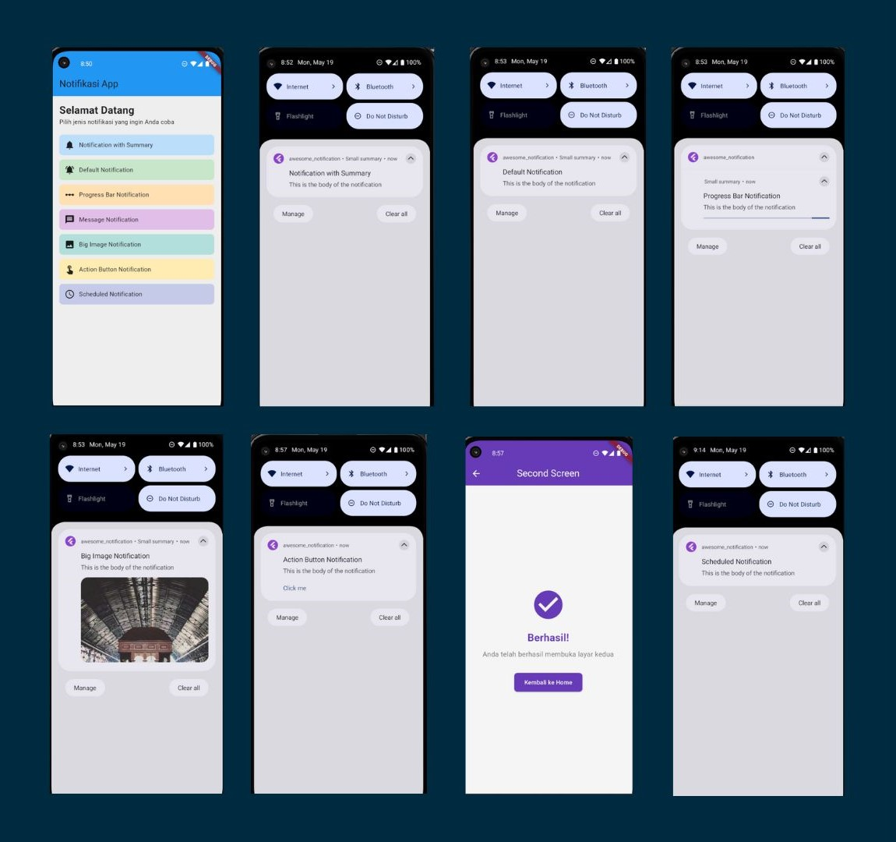
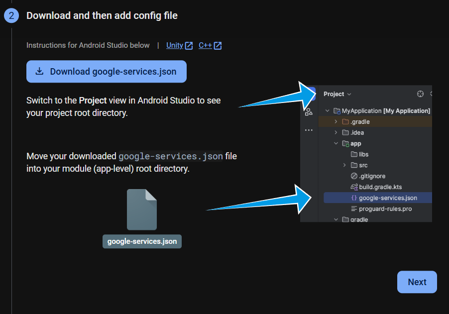

# awesome_notification



## 1. Inisialisasi firebase
1. Membuka halaman <a href="https://console.firebase.google.com/u/0/">Firebase Console.</a>
2. Membuat Project
3. Menambahkan android pada project sesuai dengan aplication_id pada aplikasi.

```dart
    defaultConfig {
        // TODO: Specify your own unique Application ID (https://developer.android.com/studio/build/application-id.html).
        applicationId = "com.example.awesome_notification"
        // You can update the following values to match your application needs.
        // For more information, see: https://flutter.dev/to/review-gradle-config.
        minSdk = 23
        targetSdk = 33
        versionCode = flutter.versionCode
        versionName = flutter.versionName
    }
```

4. Download dan add config file ke app-level root directory


## 2. Notification Service
1. Deklarasi Class dan NavugatorKey

Hal ini dilakukan untuk action button nantinya memungkinkan pemindahan page.
```dart
class NotificationService {
  static GlobalKey<NavigatorState> get navigatorKey => MyApp.navigatorKey;
}
```
2. Inisialisasi Notifikasi

```dart
await AwesomeNotifications().initialize(
      null,
      [
        NotificationChannel(
          channelGroupKey: 'basic_channel_group',
          channelKey: 'basic_channel',
          channelName: 'Basic notifications',
          channelDescription: 'Notification channel for basic tests',
          defaultColor: const Color(0xFF9D50DD),
          ledColor: Colors.white,
          importance: NotificationImportance.Max,
          channelShowBadge: true,
          playSound: true,
          criticalAlerts: true,
        ),
      ],
      channelGroups: [
        NotificationChannelGroup(
          channelGroupKey: 'basic_channel_group',
          channelGroupName: 'Basic notifications group',
        ),
      ],
      debug: true,
    );

    await AwesomeNotifications().isNotificationAllowed().then((isAllowed) {
      if (!isAllowed) {
        AwesomeNotifications().requestPermissionToSendNotifications();
      }
    });
```
3. Membuat Listener Methods

Hal ini dilakukan untuk menangani ketika listener ketika notifikasi dibuat, ditampilkan, diabaikan, dan di-reference.

```dart
await AwesomeNotifications().setListeners(
      onActionReceivedMethod: _onActionReceivedMethod,
      onNotificationCreatedMethod: _onNotificationCreateMethod,
      onNotificationDisplayedMethod: _onNotificationDisplayedMethod,
      onDismissActionReceivedMethod: _onDismissActionReceivedMethod,
    );
  }

  static Future<void> _onNotificationCreateMethod(
    ReceivedNotification receivedNotification,
  ) async {
    debugPrint('Notification created: ${receivedNotification.title}');
  }

  static Future<void> _onNotificationDisplayedMethod(
    ReceivedNotification receivedNotification,
  ) async {
    debugPrint('Notification displayed: ${receivedNotification.title}');
  }

  static Future<void> _onDismissActionReceivedMethod(
    ReceivedNotification receivedNotification,
  ) async {
    debugPrint('Notification dismissed: ${receivedNotification.title}');
  }

  static Future<void> _onActionReceivedMethod(
    ReceivedAction receivedAction,
  ) async {
    debugPrint('Notification action received: ${receivedAction.title}');
    final payload = receivedAction.payload;
    if (payload == null) return;

    if (payload['navigate'] == 'true') {
      final context = navigatorKey.currentContext;
      if (context != null) {
        Navigator.push(
          context,
          MaterialPageRoute(builder: (_) => const SecondScreen()),
        );
      } else {
        debugPrint('Context is null, cannot navigate');
      }
    }
```

4. Create Notification

Disini notifikasi menggunakan id, title, dan body dalam membentuk sebuah notifikasi. Notifikasi juga akan dapat menerima customisasi penambahan parameter tergantung dengan jenis notifikasi yang ingin dibuat (summary, payload, interval, dll).
```dart
  static Future<void> createNotification({
    required final int id,
    required final String title,
    required final String body,
    final String? summary,
    final Map<String, String>? payload,
    final ActionType actionType = ActionType.Default,
    final NotificationLayout notificationLayout = NotificationLayout.Default,
    final NotificationCategory? category,
    final String? bigPicture,
    final List<NotificationActionButton>? actionButtons,
    final bool scheduled = false,
    final Duration? interval,
  }) async {
    assert(!scheduled || (scheduled && interval != null));

    await AwesomeNotifications().createNotification(
      content: NotificationContent(
        id: id,
        channelKey: 'basic_channel',
        title: title,
        body: body,
        actionType: actionType,
        notificationLayout: notificationLayout,
        summary: summary,
        category: category,
        payload: payload,
        bigPicture: bigPicture,
      ),
      actionButtons: actionButtons,
      schedule:
          scheduled
              ? NotificationInterval(
                interval: interval,
                timeZone:
                    await AwesomeNotifications().getLocalTimeZoneIdentifier(),
                preciseAlarm: true,
              )
              : null,
    );
  }
```


## 3. Pembuat Tampilan HomeScreen dan SecondScreen
Berikut adalah kode yang digunakan untuk HomeScreen dan SecondScreen (hasil pemindahan menggunakan action button)

```dart
// HomeScreen
import 'package:flutter/material.dart';
import 'package:awesome_notification/services/notification_service.dart';
import 'package:awesome_notifications/awesome_notifications.dart';

class HomeScreen extends StatelessWidget {
  const HomeScreen({Key? key}) : super(key: key);

  @override
  Widget build(BuildContext context) {
    return Scaffold(
      backgroundColor: Colors.grey[200],
      appBar: AppBar(
        title: Text('Notifikasi App'),
        backgroundColor: Colors.blue,
      ),
      body: Padding(
        padding: EdgeInsets.all(16.0),
        child: Column(
          crossAxisAlignment: CrossAxisAlignment.start,
          children: [
            Text(
              'Selamat Datang',
              style: TextStyle(
                fontSize: 24,
                fontWeight: FontWeight.bold,
              ),
            ),
            Text('Pilih jenis notifikasi yang ingin Anda coba'),
            SizedBox(height: 20),
            Expanded(
              child: ListView(
                children: [
                  GestureDetector(
                    onTap: () async {
                      await NotificationService.createNotification(
                        id: 2,
                        title: 'Notification with Summary',
                        body: 'This is the body of the notification',
                        summary: 'Small summary',
                        notificationLayout: NotificationLayout.Inbox,
                      );
                    },
                    child: Container(
                      padding: EdgeInsets.all(12),
                      decoration: BoxDecoration(
                        color: Colors.blue[100],
                        borderRadius: BorderRadius.circular(8),
                      ),
                      child: Row(
                        children: [
                          Icon(Icons.notifications),
                          SizedBox(width: 10),
                          Text('Notification with Summary'),
                        ],
                      ),
                    ),
                  ),
                  SizedBox(height: 10),
                  
                  GestureDetector(
                    onTap: () async {
                      await NotificationService.createNotification(
                        id: 1,
                        title: 'Default Notification',
                        body: 'This is the body of the notification',
                        summary: 'Small summary',
                      );
                    },
                    child: Container(
                      padding: EdgeInsets.all(12),
                      decoration: BoxDecoration(
                        color: Colors.green[100],
                        borderRadius: BorderRadius.circular(8),
                      ),
                      child: Row(
                        children: [
                          Icon(Icons.notifications_active),
                          SizedBox(width: 10),
                          Text('Default Notification'),
                        ],
                      ),
                    ),
                  ),
                  SizedBox(height: 10),
                  
                  GestureDetector(
                    onTap: () async {
                      await NotificationService.createNotification(
                        id: 3,
                        title: 'Progress Bar Notification',
                        body: 'This is the body of the notification',
                        summary: 'Small summary',
                        notificationLayout: NotificationLayout.ProgressBar,
                      );
                    },
                    child: Container(
                      padding: EdgeInsets.all(12),
                      decoration: BoxDecoration(
                        color: Colors.orange[100],
                        borderRadius: BorderRadius.circular(8),
                      ),
                      child: Row(
                        children: [
                          Icon(Icons.linear_scale),
                          SizedBox(width: 10),
                          Text('Progress Bar Notification'),
                        ],
                      ),
                    ),
                  ),
                  SizedBox(height: 10),
                  
                  GestureDetector(
                    onTap: () async {
                      await NotificationService.createNotification(
                        id: 4,
                        title: 'Message Notification',
                        body: 'This is the body of the notification',
                        summary: 'Small summary',
                        notificationLayout: NotificationLayout.Messaging,
                      );
                    },
                    child: Container(
                      padding: EdgeInsets.all(12),
                      decoration: BoxDecoration(
                        color: Colors.purple[100],
                        borderRadius: BorderRadius.circular(8),
                      ),
                      child: Row(
                        children: [
                          Icon(Icons.message),
                          SizedBox(width: 10),
                          Text('Message Notification'),
                        ],
                      ),
                    ),
                  ),
                  SizedBox(height: 10),
                  
                  GestureDetector(
                    onTap: () async {
                      await NotificationService.createNotification(
                        id: 5,
                        title: 'Big Image Notification',
                        body: 'This is the body of the notification',
                        summary: 'Small summary',
                        notificationLayout: NotificationLayout.BigPicture,
                        bigPicture: 'https://picsum.photos/300/200',
                      );
                    },
                    child: Container(
                      padding: EdgeInsets.all(12),
                      decoration: BoxDecoration(
                        color: Colors.teal[100],
                        borderRadius: BorderRadius.circular(8),
                      ),
                      child: Row(
                        children: [
                          Icon(Icons.image),
                          SizedBox(width: 10),
                          Text('Big Image Notification'),
                        ],
                      ),
                    ),
                  ),
                  SizedBox(height: 10),
                  
                  GestureDetector(
                    onTap: () async {
                      await NotificationService.createNotification(
                        id: 6,
                        title: 'Action Button Notification',
                        body: 'This is the body of the notification',
                        payload: {'navigate': 'true'},
                        actionButtons: [
                          NotificationActionButton(
                            key: 'action_button',
                            label: 'Click me',
                            actionType: ActionType.Default,
                          )
                        ],
                      );
                    },
                    child: Container(
                      padding: EdgeInsets.all(12),
                      decoration: BoxDecoration(
                        color: Colors.amber[100],
                        borderRadius: BorderRadius.circular(8),
                      ),
                      child: Row(
                        children: [
                          Icon(Icons.touch_app),
                          SizedBox(width: 10),
                          Text('Action Button Notification'),
                        ],
                      ),
                    ),
                  ),
                  SizedBox(height: 10),
                  
                  GestureDetector(
                    onTap: () async {
                      await NotificationService.createNotification(
                        id: 7,
                        title: 'Scheduled Notification',
                        body: 'This is the body of the notification',
                        scheduled: true,
                        interval: Duration(seconds: 5),
                      );
                    },
                    child: Container(
                      padding: EdgeInsets.all(12),
                      decoration: BoxDecoration(
                        color: Colors.indigo[100],
                        borderRadius: BorderRadius.circular(8),
                      ),
                      child: Row(
                        children: [
                          Icon(Icons.schedule),
                          SizedBox(width: 10),
                          Text('Scheduled Notification'),
                        ],
                      ),
                    ),
                  ),
                ],
              ),
            ),
          ],
        ),
      ),
    );
  }
}
```

```dart
// SecondScreen
import 'package:flutter/material.dart';

class SecondScreen extends StatelessWidget {
  const SecondScreen({super.key});

  @override
  Widget build(BuildContext context) {
    return Scaffold(
      backgroundColor: Colors.grey[100],
      appBar: AppBar(
        title: const Text('Second Screen'),
        centerTitle: true,
        backgroundColor: Colors.deepPurple,
        foregroundColor: Colors.white,
        elevation: 0,
      ),
      body: Center(
        child: Padding(
          padding: const EdgeInsets.all(20.0),
          child: Column(
            mainAxisAlignment: MainAxisAlignment.center,
            children: [
              const Icon(
                Icons.check_circle,
                color: Colors.deepPurple,
                size: 80,
              ),
              const SizedBox(height: 20),
              const Text(
                'Berhasil!',
                style: TextStyle(
                  fontSize: 24,
                  fontWeight: FontWeight.bold,
                  color: Colors.deepPurple,
                ),
              ),
              const SizedBox(height: 10),
              Text(
                'Anda telah berhasil membuka layar kedua',
                style: TextStyle(
                  fontSize: 16,
                  color: Colors.grey[600],
                ),
                textAlign: TextAlign.center,
              ),
              const SizedBox(height: 30),
              ElevatedButton(
                onPressed: () => Navigator.pop(context),
                style: ElevatedButton.styleFrom(
                  backgroundColor: Colors.deepPurple,
                  foregroundColor: Colors.white,
                  padding: const EdgeInsets.symmetric(
                    horizontal: 24,
                    vertical: 12,
                  ),
                  shape: RoundedRectangleBorder(
                    borderRadius: BorderRadius.circular(8),
                  ),
                ),
                child: const Text('Kembali ke Home'),
              ),
            ],
          ),
        ),
      ),
    );
  }
}
```
HomeScreen memanfaatkan pembuatan notifikasi yang sebelumnya telah dilakukan pada Notification Service.

Pada HomeScreen terdapat beberapa notifikasi di bawah ini.

1. Default Notification
```dart
GestureDetector(
    onTap: () async {
        await NotificationService.createNotification(
        id: 1,
        title: 'Default Notification',
        body: 'This is the body of the notification',
        summary: 'Small summary',
        );
    },
    child: Container(
        padding: EdgeInsets.all(12),
        decoration: BoxDecoration(
        color: Colors.green[100],
        borderRadius: BorderRadius.circular(8),
        ),
        child: Row(
        children: [
            Icon(Icons.notifications_active),
            SizedBox(width: 10),
            Text('Default Notification'),
        ],
        ),
    ),
),
```

2. Notification with Summary 

```dart
GestureDetector(
    onTap: () async {
        await NotificationService.createNotification(
        id: 2,
        title: 'Notification with Summary',
        body: 'This is the body of the notification',
        summary: 'Small summary',
        notificationLayout: NotificationLayout.Inbox,
        );
    },
    child: Container(
        padding: EdgeInsets.all(12),
        decoration: BoxDecoration(
        color: Colors.blue[100],
        borderRadius: BorderRadius.circular(8),
        ),
        child: Row(
        children: [
            Icon(Icons.notifications),
            SizedBox(width: 10),
            Text('Notification with Summary'),
        ],
        ),
    ),
),
```

3. Progress Bar Notification

```dart
GestureDetector(
    onTap: () async {
        await NotificationService.createNotification(
        id: 3,
        title: 'Progress Bar Notification',
        body: 'This is the body of the notification',
        summary: 'Small summary',
        notificationLayout: NotificationLayout.ProgressBar,
        );
    },
    child: Container(
        padding: EdgeInsets.all(12),
        decoration: BoxDecoration(
        color: Colors.orange[100],
        borderRadius: BorderRadius.circular(8),
        ),
        child: Row(
        children: [
            Icon(Icons.linear_scale),
            SizedBox(width: 10),
            Text('Progress Bar Notification'),
        ],
        ),
    ),
),
```

4. Message Notification
```dart
GestureDetector(
    onTap: () async {
    await NotificationService.createNotification(
        id: 4,
        title: 'Message Notification',
        body: 'This is the body of the notification',
        summary: 'Small summary',
        notificationLayout: NotificationLayout.Messaging,
    );
    },
    child: Container(
    padding: EdgeInsets.all(12),
    decoration: BoxDecoration(
        color: Colors.purple[100],
        borderRadius: BorderRadius.circular(8),
    ),
    child: Row(
        children: [
        Icon(Icons.message),
        SizedBox(width: 10),
        Text('Message Notification'),
        ],
    ),
    ),
),
```

5. Big Image Notification
```dart
GestureDetector(
    onTap: () async {
        await NotificationService.createNotification(
        id: 5,
        title: 'Big Image Notification',
        body: 'This is the body of the notification',
        summary: 'Small summary',
        notificationLayout: NotificationLayout.BigPicture,
        bigPicture: 'https://picsum.photos/300/200',
        );
    },
    child: Container(
        padding: EdgeInsets.all(12),
        decoration: BoxDecoration(
        color: Colors.teal[100],
        borderRadius: BorderRadius.circular(8),
        ),
        child: Row(
        children: [
            Icon(Icons.image),
            SizedBox(width: 10),
            Text('Big Image Notification'),
        ],
        ),
    ),
),
```

6. Action Button Notification
```dart
GestureDetector(
    onTap: () async {
        await NotificationService.createNotification(
        id: 6,
        title: 'Action Button Notification',
        body: 'This is the body of the notification',
        payload: {'navigate': 'true'},
        actionButtons: [
            NotificationActionButton(
            key: 'action_button',
            label: 'Click me',
            actionType: ActionType.Default,
            )
        ],
        );
    },
    child: Container(
        padding: EdgeInsets.all(12),
        decoration: BoxDecoration(
        color: Colors.amber[100],
        borderRadius: BorderRadius.circular(8),
        ),
        child: Row(
        children: [
            Icon(Icons.touch_app),
            SizedBox(width: 10),
            Text('Action Button Notification'),
        ],
        ),
    ),
),
```

7. Schedule Notification
```dart
GestureDetector(
    onTap: () async {
        await NotificationService.createNotification(
        id: 7,
        title: 'Scheduled Notification',
        body: 'This is the body of the notification',
        scheduled: true,
        interval: Duration(seconds: 5),
        );
    },
    child: Container(
        padding: EdgeInsets.all(12),
        decoration: BoxDecoration(
        color: Colors.indigo[100],
        borderRadius: BorderRadius.circular(8),
        ),
        child: Row(
        children: [
            Icon(Icons.schedule),
            SizedBox(width: 10),
            Text('Scheduled Notification'),
        ],
        ),
    ),
)
```

## 4. Finalisasi main.dart
Finalisasi main.dart dengan integrasi Firebase (Inisiasliasi di main.dart) dengan HomeScreen dan SecondScreen.

```dart
import 'package:flutter/material.dart';
import 'services/notification_service.dart';
import 'pages/home_screen_page.dart';

void main() async {
  WidgetsFlutterBinding.ensureInitialized();
  
  await NotificationService.initializeNotification();
  
  runApp(const MyApp());
}

class MyApp extends StatelessWidget {
  static final GlobalKey<NavigatorState> navigatorKey = GlobalKey<NavigatorState>();
  
  const MyApp({super.key});

  @override
  Widget build(BuildContext context) {
    return MaterialApp(
      navigatorKey: navigatorKey, 
      title: 'Notifikasi App',
      home: const HomeScreen(),
    );
  }
}
```